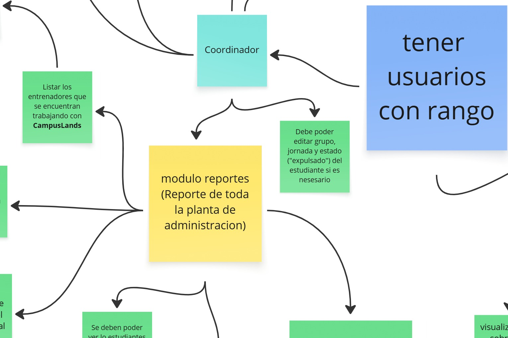

# Programa de gestión Campuslands

 Aplicación de consola para gestionar campers, trainers, coordinadores y grupos — crear grupos, asignar campers y registrar evaluaciones (La funcionalidad principal de campuslands).

**Diagrama de requerimientos**

Link directo para visualizar el diagrama: https://miro.com/welcomeonboard/VE1pMmJNUHJGSEJPbkdTSTRKT3VMU3lLOFZVODNyTUZxb0FiYStyRm9QaGprV0M2N0M4WkhXalR5eDBaeFhzdy92dU1MS2lSSzVwNGhGTktNK2VESldiWDBoODFwQ1dOVXVidGt0SGpsamVVQXpGVUw5eFpySERzQmFXUFc4UUpyVmtkMG5hNDA3dVlncnBvRVB2ZXBnPT0hdjE=?share_link_id=104986241899